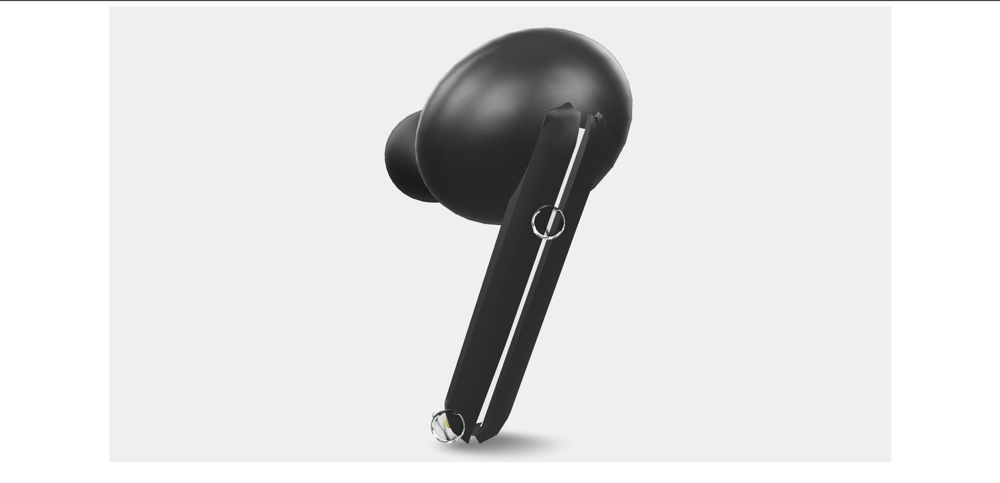

# Kumar-Jashan_Earbuds-Website
This repository contains the source code for a custom earbuds brand website. It showcases sleek product designs, interactive features, and a responsive layout, providing an intuitive user experience for exploring and purchasing earbuds.
# Earbuds Website - README

Welcome to the Earbuds Website! This project showcases the latest earbuds model from our brand, featuring a sleek design and cutting-edge technology. Explore the website to learn more about the product's features, design, and specifications.

---

## Features

- **Product Showcase**: High-quality visuals of the earbuds.
- **Specifications**: Detailed tech specs and product highlights.
- **Interactive UI**: User-friendly interface with smooth navigation.
- **Responsive Design**: Optimized for both desktop and mobile devices.

---

## Installation

No installation is required.

---

## Usage

Simply open `index.html` in your preferred web browser to explore the site locally.

---

## Contributing

We welcome contributions! Here's how you can help:

1. Fork the repository.
2. Create your feature branch: `git checkout -b feature/new-feature`.
3. Commit your changes: `git commit -m 'Add new feature'`.
4. Push to the branch: `git push origin feature/new-feature`.
5. Open a pull request.

---

## History

- Initial Launch: Novber 7, 2024  
- Feature Update: Novber 7, 2024  
- Design Overhaul: Novber 7, 2024  
---

## Credits

Developed and designed by Jashan Kumar.

---

## License

This project is licensed under the MIT License. See the `LICENSE` file for details.
